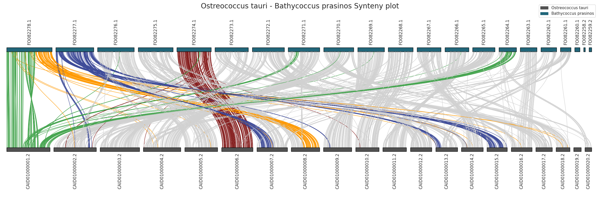

# BUSCO-Plot-Py

Buscoplotpy is a library that allows graphical visualization and proper interpretation of completeness analysis results obtained using the BUSCO software.

## Installation

You can easily install the library by running the following command

```bash
pip install buscoplotpy
```

## Types of graphs

BuscoPlotPy allow you to generate several kinds of plots that can help you to interpret correctly your BUSCO's analysis.

### BUSCO completeness barplot

This function generates a barplot to visualize the completeness of assembly for different organisms based on BUSCO summary json file.

The function takes in input a dataframe that contains all (json summary file) informations about all the analyzed organisms. In each row there are all BUSCO's informations about the organism.


```python
def organism_busco_barplot(df: pd.DataFrame,
                           group_name: str = 'Chlorophyta',
                           organism_name: str = 'Bathycoccus prasinos',
                           out_path: str = './', 
                           filename: str = 'busco_barplot',
                           dpi: int = 300,
                           plt_show: bool = False
) -> None:
```

<p align="center">

</p>

**Parameters:**

- **df** (pd.DataFrame): The input dataframe containing the data to be plotted.
- **group_name** (str): The name of the group to be plotted.
- **organism_name** (str): The name of the organism to be plotted.
- **out_path** (str): The path where the plot image will be saved.
- **filename** (str): The name of the plot image file.
- **dpi** (int): Dots per inch for the resolution of the saved image.
- **plt_show** (bool): If True, the plot will be displayed using plt.show().


### BUSCO karyotype plot

A karyotype plot is a graphical representation of the chromosomes of an organism arranged in a standard format based on their size, shape, and banding patterns. It provides a visual overview of the complete set of chromosomes present in an individual or a species.

BUSCO searches the provided genome or transcriptome against the reference database of universal single-copy orthologs. It identifies and counts the number of BUSCOs that are present, duplicated, fragmented, or missing in the target assembly.

- **Complete** BUSCOs: Genes that are found in the assembly exactly once, indicating a complete representation.

- **Duplicated** BUSCOs: Genes that are found more than once, suggesting potential gene duplications in the assembly.

- **Fragmented** BUSCOs: Genes that are present in the assembly but are incomplete or fragmented.

- **Missing** BUSCOs: Genes that are entirely absent from the assembly.

The karyotype plot can help us to visualize position (and the status) of BUSCOs on the relative chromosomes.

<p align="center">

</p>

<p align="center">

</p>

### BUSCO synteny plot

<p align="center">

</p>

<p align="center">

</p>

### Other library's features

There are some auxiliary functions that help the user to correctly load the BUSCO result files into pandas dataframe.

1) **Load BUSCO summary file**
    >Load the summary file generated by BUSCO into a pandas DataFrame.
    > 
    >*Parameters:*
    > - path (str): The path to the BUSCO json summary file.
    >     
    >*Returns:*
    > - pd.DataFrame: The loaded summary table with busco gene information.
    >```python
    >def load_json_summary(path: str) -> pd.DataFrame:
    >```
    >*/buscoplotpy/utils/load_json_summary.py*

2) **Load BUSCO full table**
    >Load the full table generated by BUSCO into a pandas DataFrame.
    >
    >*Parameters:*
    >
    >- group (str): The group the organism belongs to.
    >- organism (str): The name of the organism.
    >- genome_version (str): The version of the genome.
    >- path (str): The path to the full table.
    >    
    >*Returns:*
    >
    >- pd.DataFrame: The loaded full table with busco gene information.
    >
    >
    >
    >```python
    >def load_busco_fulltable(path: str, 
    >                          group: str='', 
    >                          organism: str='', 
    >                          genome_version: str=''
    >) -> pd.DataFrame:
    >```
    >*/buscoplotpy/utils/load_busco_fulltable.py*


## Contacts
- **Author:** Lorenzo Arcioni
- **Email:** lorenzo.arcioni2000@gmail.com
