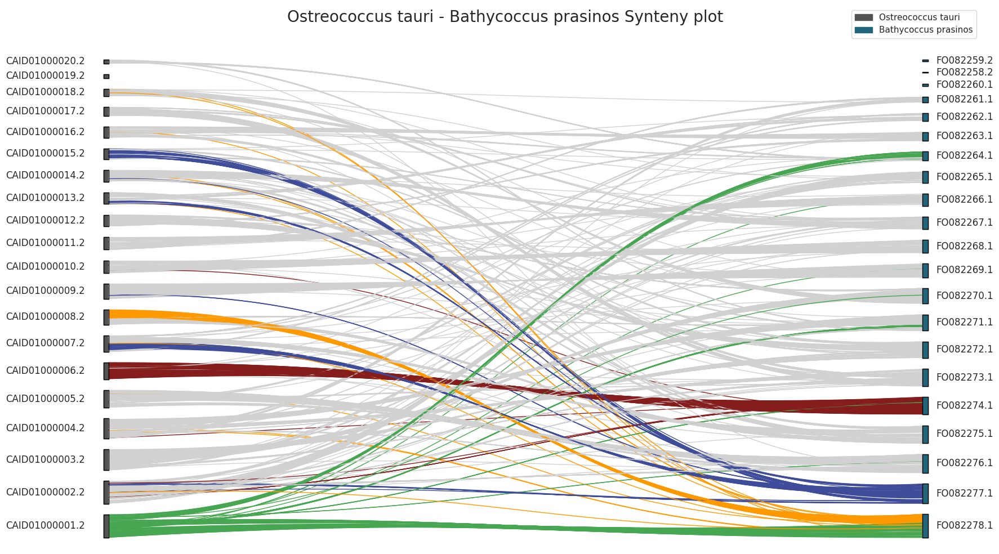

# BUSCO-Plot-Py

Interpreting BUSCO output can be a bit challenging, this because it generates many files and folders containing 
information about the analysis, especially if you're not familiar with the specific details provided by the tool.

**Buscoplotpy** is a library that allows graphical visualization and proper interpretation of completeness analysis results, 
obtained using the BUSCO software, in a super-easy and user-friendly manner. By seamlessly integrating with popular 
data visualization tools such as Matplotlib and Seaborn, **Buscoplotpy** transforms the raw output generated by BUSCO into clear, 
insightful plots that facilitate a quick and comprehensive understanding of the genomic assessment.

Note that this library is optimized to work in a Jupyter environment, but you can use it in your Python 3 script as well!

Please visit the [wiki](https://busco-plot-py.readthedocs.io/en/latest/index.html) page for more in-depth details and tutorials.

## Installation

You can easily install the library in your environment by running the following command.

```bash
pip install buscoplotpy
```

## Types of graphs

BuscoPlotPy allow you to generate several kinds of plot.

### BUSCO completeness barplot

The BUSCO's summary file is not easy to understand, specially if you are analyzing a lot of them.
This function generates a barplot to visualize the completeness of assembly for different organisms based on BUSCO's summary files.

The function takes in input a dataframe that contains all (json summary file) informations about all the analyzed organisms. In each row there are all BUSCO's informations about the organism.

The input dataframe can be obtained simply by using the [load_json_sumary()](#load-busco-summary-file) function.

*Location*: */buscoplotpy/graphics/organism_busco_barplot.py*

<p align="center">

</p>


### BUSCO karyotype plot

A karyotype plot is a graphical representation of the chromosomes of an organism arranged in a standard format based on their size, shape, and banding patterns. It provides a visual overview of the complete set of chromosomes present in an individual or a species.

BUSCO searches the provided genome or transcriptome against the reference database of universal single-copy orthologs. It identifies and counts the number of BUSCOs that are present, duplicated, fragmented, or missing in the target assembly.

- **Complete** BUSCOs: Genes that are found in the assembly exactly once, indicating a complete representation.

- **Duplicated** BUSCOs: Genes that are found more than once, suggesting potential gene duplications in the assembly.

- **Fragmented** BUSCOs: Genes that are present in the assembly but are incomplete or fragmented.

- **Missing** BUSCOs: Genes that are entirely absent from the assembly.

The karyotype plot can help us to visualize position (and the status) of found Complete/Duplicated/Fragmented BUSCOs on the relative chromosomes. This can be done by using the karyoplot function.


<p align="center">

<br>
<em>Fig1: Chloropicon primus karyoplot with green color palette.</em>
</p>

<p align="center">

<br>
<em>Fig2: Bathycoccus prasinos karyoplot with azure color palette.</em>
</p>

### BUSCO chromoplot

Gene discovery software plays a crucial role in identifying and annotating genes within a genome. One common output format for gene prediction results is the General Feature Format (GFF), which provides a standardized way to represent genomic features such as genes, mRNAs, coding sequences (CDS), and exons, along with their coordinates. 

When using BUSCO with the metaeukaryota (METAeuk) or AUGUSTUS model, the GFF output will contain annotations for the predicted genes.
And here, once again, it is not a given to interpret the results found in the GFF file correctly and easily. The chromoplot function has been implemented precisely with the purpose of simplifying the interpretation and analysis of this type of data. The function is indeed capable of creating a density plot for each sequence in the karyotype file of the organism under examination, thus generating an image that contains all the plots for all sequences in the karyotype file.

<p align="center">

<br>
<em>Fig3: Bathycoccus prasinos karyoplot with azure color palette.</em>
</p>

### BUSCO synteny plot

A synteny plot is a graphical representation that displays the arrangement of homologous genomic regions, often genes or other functional elements, in two or more related species or genomes. It provides a visual representation of the conservation and rearrangement of gene order or sequences across different genomes. In a synteny plot, homologous regions are typically connected by lines or blocks, highlighting the degree of conservation or divergence between the genomes being compared.

When working with BUSCO output, the synteny plot can be very helpful in the context of synteny analysis :

- **Identification of Orthologous Regions:** BUSCO identifies conserved orthologous genes, and their positions can be used as anchor points in a synteny plot. These orthologous genes serve as markers for comparing genomic arrangements between different species.

- **Comparative Analysis:** Synteny plots can be generated by comparing the genomic positions of BUSCO-identified orthologs in different genomes. The plot will illustrate the degree of conservation or divergence in gene order.

- **Validation of Genome Structure:** Synteny analysis using BUSCO output can help validate the overall structure of genome assemblies. Discrepancies or rearrangements in the synteny plot may indicate potential issues with the assembly.

- **Evolutionary Insights:** Synteny plots generated with BUSCO data contribute to a better understanding of the evolutionary dynamics and genomic architecture among related species.

The integration of BUSCO output into synteny analysis enhances the interpretation of genomic data by providing a standardized set of conserved genes for cross-genomic comparisons. It aids researchers in assessing genome quality, understanding evolutionary relationships, and identifying structural variations across genomes.

<p align="center">

</p>

<p align="center">

</p>

### Other library's features

There are some auxiliary functions that help the user to correctly load the BUSCO result files into pandas dataframe.

1) #### Load BUSCO summary file
    Load the summary file generated by BUSCO into a pandas DataFrame.
    *Location*: */buscoplotpy/utils/load_json_summary.py*

2) #### Load BUSCO full table
    Load the full table generated by BUSCO into a pandas DataFrame.
    *Location*: */buscoplotpy/utils/load_busco_fulltable.py*

3) #### Load BUSCO MetaEuk coordinates
    Load the MetaEuk (gene prediction software) coordinates from MetaEuk's output directory.
    *Location*: */buscoplotpy/utils/load_metaeuk_coordinates.py*


## Contacts
- **Author:** Lorenzo Arcioni
- **Email:**  lorenzo.arcioni2000@gmail.com
