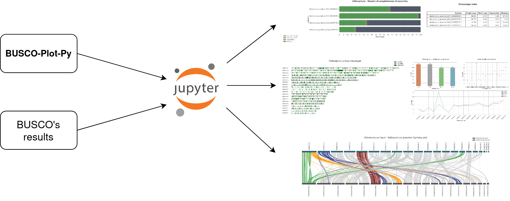

.. BUSCO-Plot-Py documentation master file, created by
   sphinx-quickstart on Thu Dec  7 16:25:32 2023.
   You can adapt this file completely to your liking, but it should at least
   contain the root `toctree` directive.

BUSCO-Plot-Py |ProjectVersion|
=========================================

Interpreting BUSCO output can be a bit challenging, this because it generates many files and folders containing 
information about the analysis, especially if you're not familiar with the specific details provided by the tool.

Buscoplotpy is a library that allows graphical visualization and proper interpretation of completeness analysis results 
obtained using the BUSCO software in a super-easy and user-friendly manner. By seamlessly integrating with popular 
data visualization tools such as Matplotlib and Seaborn, Buscoplotpy transforms the raw output generated by BUSCO into clear, 
insightful plots that facilitate a quick and comprehensive understanding of the genomic assessment.

Functionalities
---------------

BUSCO-Plot-Py currently provides these functionalities:

-  Construction of a dataframe from BUSCO summary file.
-  Construction of a dataframe from BUSCO full_table file.
-  Load MetaEuk (gff) coordinates file into a pandas DataFrame.
-  Generation of a karyotype plot based on BUSCO's full_table and a karyotype file.
-  Gneneration of a synteny plot based on two BUSCO run output and two karyotype file.
-  Generation of a barplot based on multiple BUSCO runs.
-  Generation of a density plot for each chromosome with MetaEuk predictions. 

Licence
-------

BUSCO-Plot-Py has been licensed under the `MIT License <https://github.com/lorenzo-arcioni/BUSCO-Plot-Py/blob/main/LICENSE>`_

Contents
--------

.. toctree::
   :maxdepth: 2
   :caption: Introduction

   installation
   functionalities
   tutorial
   
.. toctree::
   :maxdepth: 2
   :caption: Modules
   
   modules